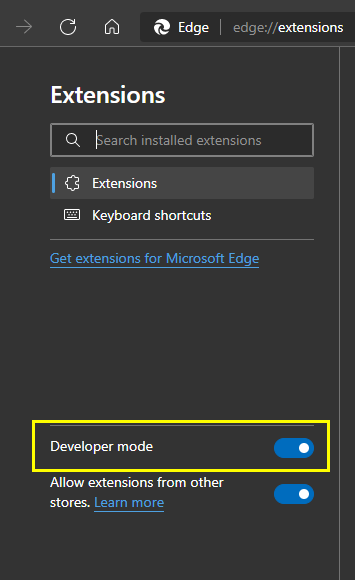
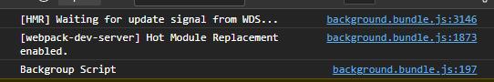

# chrome-manifest-v3-webpack-hotreload-template
Chrome Extension Template (Manifest v3) Webpack Hot reload

## Pre-requisite
- [NodeJs](https://nodejs.org/) `v17.4.0`

## Project setup
- Install dependencies
```
npm install
```
- Build for production
```
npm run build
```
- Start working on locally
```
npm run start
```

## Load extension in browser locally
- Turn on developer mode in (`chrome://extensions` or `edge://extensions`)


- Then click on `Load unpacked`
- Select `dist` folder inside this repo folder(It will get generated after running either `build` or `start` command)

- If you have run `start` command, you can see something like this in browser console


## Features
- Extension is working for `Chrome` and `Edge`.
- Content Scripts
- Popup
- Service Worker (Background script)
- Webpack Hot reload

## Note
- Hot reload isn't working for content script in Manifest v3